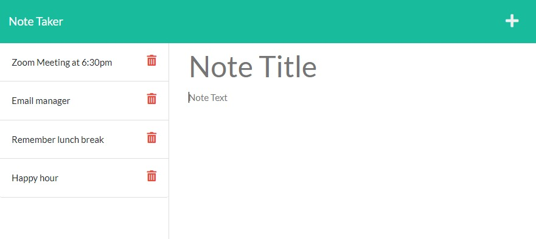

  # The Note Taker App
  

  ## Description:
  Deployed: https://note-taker-app-bw.herokuapp.com/    The motivation behind this project was to create an application where a user is able to write and save notes to more efficiently organize and keep track of thoughts and tasks. This Note Taker app uses Express.js to retrieve notes saved into a created database. The inputed note appears immediately to the side and is able to be deleted.     For future development of this project, I would like to add a time feature and a way to reorder notes.
   

  ## Table of Contents:
  * [Installation](#installation)
  * [Usage](#usage)
  * [License](#license)
  * [Contributing](#contributing)
  * [Tests](#tests)
  * [Questions](#questions)

  ## Installation:
  This application is deployed on Heroku: https://note-taker-app-bw.herokuapp.com/
    No installation is required.
   
  
  ## Usage:
        An easy to use app where the user must enter both a title and description for each note. The application creates a database by what is inputted and appends it on the page. The information is saved in a json file and can be returned to at a later time.
     

  ## License: 
  
   
  Licensed under MIT License.
   

  ## Contributing:
  To contribute to this project, contact me at 
  briannaewoodruff@gmail.com or visit my GitHub [briannawoodruff](https://github.com/briannawoodruff).
   

  ## Tests:
  N/A
   
  
  ## Questions:
  If you have any questions, you can contact me at briannaewoodruff@gmail.com or visit my GitHub [briannawoodruff](https://github.com/briannawoodruff).
  